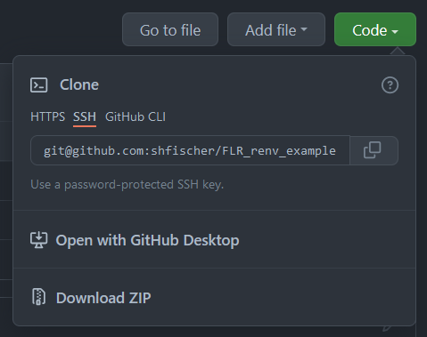

```{r setup, include=FALSE}
knitr::opts_chunk$set(echo = TRUE)
```

This is an example document to show how the R package `renv` can be used to create a reproducible FLR script.

## Start using `renv`

For this example to work, the R package `renv` needs to be installed first. `renv` is available from CRAN.

```{r eval=FALSE}
install.packages("renv")
```

## Clone repository

The easiest way to run this example, is to clone this GitHub repository. This can be done by clicking on the green "Code" button above (see screenshot), and clone the repository with the address in an environment of your choice, with GitHub Desktop or by downloading the content as a zip file.



## Install FLR packages

Because we are working with FLR packages, these need to be build from source. This will require tools for compiling these. These tools need to be installled before we can install the FLR packages. On Windows, this requires Rtools https://cran.r-project.org/bin/windows/Rtools/rtools40.html.

The `renv` package can create snapshots of all used R packages, including their dependencies. The record is stored in the [`renv.lock`](https://github.com/shfischer/FLR_renv_example/blob/main/renv.lock) file, which includes the exact package version and the source from where the packages can be installed. The list of packages is quite extensive because it also includes the packages required to compile the other FLR packages. `renv` creates a local R package library (e.g. in renv/library/R-4.1/x86_64-w64-mingw32) where it stores the R packages.

More details about `renv` can be found at https://rstudio.github.io/renv/.

Once the repository has been cloned, we can install (restore) all R packages defined in [`renv.lock`](https://github.com/shfischer/FLR_renv_example/blob/main/renv.lock) with one command and following the interactive installer.

```{r eval=FALSE}
renv::restore()
```
```
This project has not yet been activated.
Activating this project will ensure the project library is used during restore.
Please see `?renv::activate` for more details.

Would you like to activate this project before restore? [Y/n]:
```
Activate the project when asked (type "y" and press Enter):

After that, there will be list of all the R package to be installed:
```
* Project 'FLR_renv_example_test' loaded. [renv 0.15.0]
* The project library is out of sync with the lockfile.
* Use `renv::restore()` to install packages recorded in the lockfile.
The following package(s) will be updated:

# CRAN ===============================
- R6             [* -> 2.5.1]
- RColorBrewer   [* -> 1.1-2]
- Rcpp           [* -> 1.0.8]
- askpass        [* -> 1.1]
- brew           [* -> 1.0-6]
- brio           [* -> 1.1.3]
- cachem         [* -> 1.0.6]
- callr          [* -> 3.7.0]
- cli            [* -> 3.1.1]
- clipr          [* -> 0.7.1]
- colorspace     [* -> 2.0-2]
- commonmark     [* -> 1.7]
- cowplot        [* -> 1.1.1]
- cpp11          [* -> 0.4.2]
- crayon         [* -> 1.4.2]
- credentials    [* -> 1.3.2]
- curl           [* -> 4.3.2]
- data.table     [* -> 1.14.2]
- desc           [* -> 1.4.0]
- devtools       [* -> 2.4.3]
- diffobj        [* -> 0.3.5]
- digest         [* -> 0.6.29]
- ellipsis       [* -> 0.3.2]
- evaluate       [* -> 0.14]
- fansi          [* -> 1.0.2]
- farver         [* -> 2.1.0]
- fastmap        [* -> 1.1.0]
- fs             [* -> 1.5.2]
- gert           [* -> 1.5.0]
- ggplot2        [* -> 3.3.5]
- gh             [* -> 1.3.0]
- gitcreds       [* -> 0.1.1]
- glue           [* -> 1.6.1]
- gridExtra      [* -> 2.3]
- gtable         [* -> 0.3.0]
- highr          [* -> 0.9]
- httr           [* -> 1.4.2]
- ini            [* -> 0.3.1]
- isoband        [* -> 0.2.5]
- iterators      [* -> 1.0.13]
- jsonlite       [* -> 1.7.3]
- knitr          [* -> 1.37]
- labeling       [* -> 0.4.2]
- lifecycle      [* -> 1.0.1]
- magrittr       [* -> 2.0.1]
- memoise        [* -> 2.0.1]
- mime           [* -> 0.12]
- munsell        [* -> 0.5.0]
- openssl        [* -> 1.4.6]
- pillar         [* -> 1.6.4]
- pkgbuild       [* -> 1.3.1]
- pkgconfig      [* -> 2.0.3]
- pkgload        [* -> 1.2.4]
- praise         [* -> 1.0.0]
- prettyunits    [* -> 1.1.1]
- processx       [* -> 3.5.2]
- ps             [* -> 1.6.0]
- purrr          [* -> 0.3.4]
- rappdirs       [* -> 0.3.3]
- rcmdcheck      [* -> 1.4.0]
- rematch2       [* -> 2.1.2]
- remotes        [* -> 2.4.2]
- rlang          [* -> 0.4.12]
- roxygen2       [* -> 7.1.2]
- rprojroot      [* -> 2.0.2]
- rstudioapi     [* -> 0.13]
- rversions      [* -> 2.1.1]
- scales         [* -> 1.1.1]
- sessioninfo    [* -> 1.2.2]
- stringi        [* -> 1.7.6]
- stringr        [* -> 1.4.0]
- sys            [* -> 3.4]
- testthat       [* -> 3.1.2]
- tibble         [* -> 3.1.6]
- usethis        [* -> 2.1.5]
- utf8           [* -> 1.2.2]
- vctrs          [* -> 0.3.8]
- viridisLite    [* -> 0.4.0]
- waldo          [* -> 0.3.1]
- whisker        [* -> 0.4]
- withr          [* -> 2.4.3]
- xfun           [* -> 0.29]
- xml2           [* -> 1.3.3]
- xopen          [* -> 1.0.0]
- yaml           [* -> 2.2.1]
- zip            [* -> 2.2.0]

# GitHub =============================
- FLFishery      [* -> flr/FLFishery@HEAD]
- FLasher        [* -> flr/FLasher@HEAD]
- ggplotFL       [* -> flr/ggplotFL@HEAD]

# flr ================================
- FLCore         [* -> flr/FLCore@HEAD]

Do you want to proceed? [y/N]:
```
Select "y" to proceed.

```
Retrieving 'https://api.github.com/repos/flr/FLCore/tarball/3ce02d8437b0d407afe8d30811ccfa2985c547ca' ...
	OK [downloaded 4.8 Mb in 1.2 secs]
Retrieving 'https://api.github.com/repos/flr/FLFishery/tarball/8be4de01deed55020c384e79be200372d1c5c09f' ...
	OK [downloaded 86.2 Kb in 0.7 secs]
Retrieving 'https://api.github.com/repos/flr/ggplotFL/tarball/0780bb8bbfde150ca0f86fc22406e0ad8ecb0493' ...
	OK [downloaded 8.3 Mb in 1.2 secs]
Retrieving 'https://api.github.com/repos/flr/FLasher/tarball/a993820670f5b34afa06635baa00178b35f98269' ...
	OK [downloaded 4.5 Mb in 1.1 secs]
Installing digest [0.6.29] ...
	OK [linked cache]
Installing glue [1.6.1] ...
	OK [linked cache]
Installing gtable [0.3.0] ...
	OK [linked cache]
Installing isoband [0.2.5] ...
	OK [linked cache]
Installing rlang [0.4.12] ...
	OK [linked cache]
Installing farver [2.1.0] ...
	OK [linked cache]
Installing labeling [0.4.2] ...
	OK [linked cache]
Installing lifecycle [1.0.1] ...
	OK [linked cache]
Installing colorspace [2.0-2] ...
	OK [linked cache]
Installing munsell [0.5.0] ...
	OK [linked cache]
Installing R6 [2.5.1] ...
	OK [linked cache]
Installing RColorBrewer [1.1-2] ...
	OK [linked cache]
Installing viridisLite [0.4.0] ...
	OK [linked cache]
Installing scales [1.1.1] ...
	OK [linked cache]
Installing ellipsis [0.3.2] ...
	OK [linked cache]
Installing fansi [1.0.2] ...
	OK [linked cache]
Installing magrittr [2.0.1] ...
	OK [linked cache]
Installing cli [3.1.1] ...
	OK [linked cache]
Installing crayon [1.4.2] ...
	OK [linked cache]
Installing utf8 [1.2.2] ...
	OK [linked cache]
Installing vctrs [0.3.8] ...
	OK [linked cache]
Installing pillar [1.6.4] ...
	OK [linked cache]
Installing pkgconfig [2.0.3] ...
	OK [linked cache]
Installing tibble [3.1.6] ...
	OK [linked cache]
Installing withr [2.4.3] ...
	OK [linked cache]
Installing ggplot2 [3.3.5] ...
	OK [linked cache]
Installing iterators [1.0.13] ...
	OK [linked cache]
Installing FLCore [2.6.18.9010] ...
	OK [built from source]
Moving FLCore [2.6.18.9010] into the cache ...
	OK [moved to cache in 50 milliseconds]
Installing gridExtra [2.3] ...
	OK [linked cache]
Installing cowplot [1.1.1] ...
	OK [linked cache]
Installing data.table [1.14.2] ...
	OK [linked cache]
Installing ggplotFL [2.6.10.9001] ...
	OK [built from source]
Moving ggplotFL [2.6.10.9001] into the cache ...
	OK [moved to cache in 7 milliseconds]
Installing FLFishery [0.3.7.9003] ...
	OK [built from source]
Moving FLFishery [0.3.7.9003] into the cache ...
	OK [moved to cache in 6 milliseconds]
Installing Rcpp [1.0.8] ...
	OK [linked cache]
Installing FLasher [0.6.8.9003] ...
	OK [built from source]
Moving FLasher [0.6.8.9003] into the cache ...
	OK [moved to cache in 6 milliseconds]
Installing sys [3.4] ...
	OK [linked cache]
Installing askpass [1.1] ...
	OK [linked cache]
Installing brew [1.0-6] ...
	OK [linked cache]
Installing brio [1.1.3] ...
	OK [linked cache]
Installing fastmap [1.1.0] ...
	OK [linked cache]
Installing cachem [1.0.6] ...
	OK [linked cache]
Installing ps [1.6.0] ...
	OK [linked cache]
Installing processx [3.5.2] ...
	OK [linked cache]
Installing callr [3.7.0] ...
	OK [linked cache]
Installing clipr [0.7.1] ...
	OK [linked cache]
Installing commonmark [1.7] ...
	OK [linked cache]
Installing cpp11 [0.4.2] ...
	OK [linked cache]
Installing openssl [1.4.6] ...
	OK [linked cache]
Installing curl [4.3.2] ...
	OK [linked cache]
Installing jsonlite [1.7.3] ...
	OK [linked cache]
Installing credentials [1.3.2] ...
	OK [linked cache]
Installing rprojroot [2.0.2] ...
	OK [linked cache]
Installing desc [1.4.0] ...
	OK [linked cache]
Installing fs [1.5.2] ...
	OK [linked cache]
Installing mime [0.12] ...
	OK [linked cache]
Installing httr [1.4.2] ...
	OK [linked cache]
Installing memoise [2.0.1] ...
	OK [linked cache]
Installing prettyunits [1.1.1] ...
	OK [linked cache]
Installing pkgbuild [1.3.1] ...
	OK [linked cache]
Installing rstudioapi [0.13] ...
	OK [linked cache]
Installing pkgload [1.2.4] ...
	OK [linked cache]
Installing sessioninfo [1.2.2] ...
	OK [linked cache]
Installing xopen [1.0.0] ...
	OK [linked cache]
Installing rcmdcheck [1.4.0] ...
	OK [linked cache]
Installing remotes [2.4.2] ...
	OK [linked cache]
Installing evaluate [0.14] ...
	OK [linked cache]
Installing xfun [0.29] ...
	OK [linked cache]
Installing highr [0.9] ...
	OK [linked cache]
Installing stringi [1.7.6] ...
	OK [linked cache]
Installing stringr [1.4.0] ...
	OK [linked cache]
Installing yaml [2.2.1] ...
	OK [linked cache]
Installing knitr [1.37] ...
	OK [linked cache]
Installing purrr [0.3.4] ...
	OK [linked cache]
Installing xml2 [1.3.3] ...
	OK [linked cache]
Installing roxygen2 [7.1.2] ...
	OK [linked cache]
Installing rversions [2.1.1] ...
	OK [linked cache]
Installing praise [1.0.0] ...
	OK [linked cache]
Installing diffobj [0.3.5] ...
	OK [linked cache]
Installing rematch2 [2.1.2] ...
	OK [linked cache]
Installing waldo [0.3.1] ...
	OK [linked cache]
Installing testthat [3.1.2] ...
	OK [linked cache]
Installing zip [2.2.0] ...
	OK [linked cache]
Installing gert [1.5.0] ...
	OK [linked cache]
Installing gitcreds [0.1.1] ...
	OK [linked cache]
Installing ini [0.3.1] ...
	OK [linked cache]
Installing gh [1.3.0] ...
	OK [linked cache]
Installing rappdirs [0.3.3] ...
	OK [linked cache]
Installing whisker [0.4] ...
	OK [linked cache]
Installing usethis [2.1.5] ...
	OK [linked cache]
Installing devtools [2.4.3] ...
	OK [linked cache]

Consider restarting the R session and loading the newly-installed packages.


Restarting R session...

* Project 'FLR_renv_example_test' loaded. [renv 0.15.0]
```

If R packages already exist in the global R library, they will simply be copied into the local project library.

This completes the R package installation.

## A reproducible example

After the installation, it is possible to run the [example code](https://github.com/shfischer/FLR_renv_example/blob/main/script_example.md)

