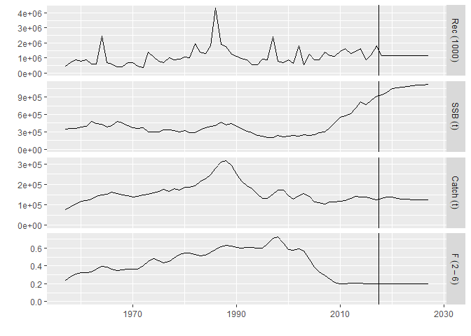

Example script
================

This is an example script which produces reproducible output when used
in combination with renv

Let’s load some FLR packages:

``` r
library(FLCore)
library(ggplotFL)
library(FLasher)
```

These packages should now be exactly the version specified in the
`renv.lock` file:

``` r
### check FLasher
packageDescription("FLasher", fields = "Version", drop = TRUE)
```

    ## [1] "0.6.8.9003"

``` r
packageDescription("FLasher", fields = "RemoteSha", drop = TRUE)
```

    ## [1] "a993820670f5b34afa06635baa00178b35f98269"

Now we can run a projection with FLasher (example adapted from [FLR
tutorial](https://flr-project.org/doc/Forecasting_on_the_Medium_Term_for_advice_using_FLasher.html)):

``` r
### load plaice data
data(ple4)
### prepare stock for projection
ple4_mtf <- stf(ple4, nyears = 10)
### create stock-recruitment model
ple4_sr <- fmle(as.FLSR(ple4, model = "bevholt"), control = list(trace = 0))
### set projection target
ctrl_target <- data.frame(year = 2018:2027, quant = "f", value = 0.2)
ctrl_f <- fwdControl(ctrl_target)
### project
ple4_f <- fwd(ple4_mtf, control = ctrl_f, sr = ple4_sr)
```

This should now lead to the same results:

``` r
plot(ple4_f) + geom_vline(xintercept = 2017.5)
```

<!-- -->

``` r
ssb(ple4_f)[, ac(2018:2027)]
```

    ## An object of class "FLQuant"
    ## , , unit = unique, season = all, area = unique
    ## 
    ##      year
    ## age   2018    2019    2020    2021    2022    2023    2024    2025    2026   
    ##   all  941449  980508 1042198 1064067 1074985 1085074 1096265 1104480 1112659
    ##      year
    ## age   2027   
    ##   all 1116879
    ## 
    ## units:  t
